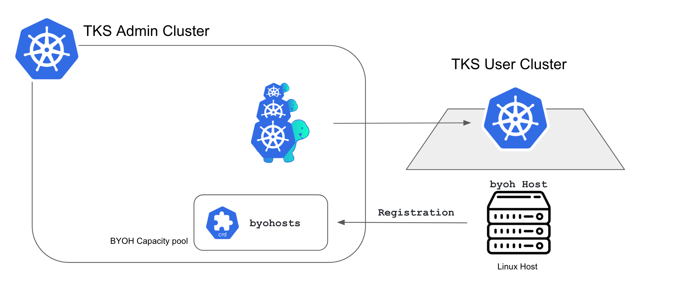

# BYOH Provider

!!! Info ""
    BYOH Agent가 설치된 서버에 Clcuster API를 사용하여 Kubernetes를 설치하는 기능

## 개요

Cluster API는 Kubernetes자체도 Kubernetes로 관리하는 혁신적인 기술 이다. CAPI를 통해 AWS, Azure그리고 GCP와 같은 대중적인 CSP는 지원하지만, 국내 Public Cloud 업체나 On-prem 서버들은 CAPI의 장점을 적용할 수 없었다.
하지만, BYOH Provider를 VMware가 제공하면서, CAPI의 Coverage가 거의 무한대로 커졌다.
TKS는 BYOH provider support 기능을 통해, Naver와 같은 국내 CSP와 On-prem을 동일한 Decapod 체계로 관리하는 기능을 제공한다.

***

## 동기 (Motivation)

### 국내 CSP 및 Hybrid Cloud 환경 지원   

TKS는 release 2.0에서 CAPI와 GitOps 체계를 도입하면서 Service와 Cluster를 동일한 방법으로 관리한다.
하지만 국내의 경우 국내 CSP를 사용하는 비율이 적지 않고, On-prem에 SDDC를 구축한 경우도 적지 않기 떄문에, 다양한 Pubic Cloud과 Private Cloud 를 모두 지원해야 한다. 따라서 CAPI Provider를 별도로 제공하지 않는 Cloud에 TKS 를 제공하기 위해 BYOH Provier를 지원하기로 결정했다.

## 기술 설명   
#### BYOH 설명

BYOH Provider는 CAPI의 Abstration 구조를 활용하여 기능을 제공한다. 즉 IaaS Layer의 Kubernetes의 논리 구성요소를 분리해서 관리하고 있다. BYOH는 IaaS layer의 Networking이 미리 설정되어 있는 Server에 BYOH Agent를 설치하여, K8S의 Custom Resource인 Byohsot고 관리한다.
BYOH Host Agent는 현재 Ubuntu를 지원하며, Agent bootatrap kubeconfig 파일을 통해 byohost를 생성하는 방식으로 운영된다.   

