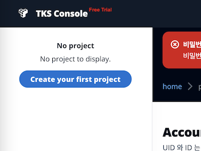
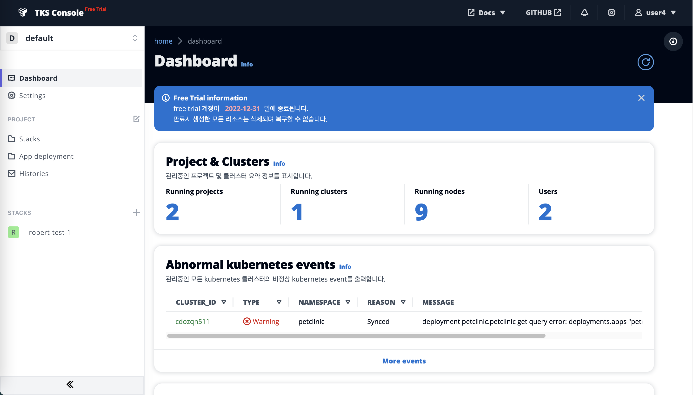

# Creating Project

TKS 접속 후 가장 먼저 할 일은 프로젝트를 만드는 것입니다. 

"Create your first project" 버튼을 클릭하여 프로젝트를 생성합니다. Free-Trial 버전은 template 커스터마이징을 제공하지 않으므로 기본 설정으로 생성합니다.

> 프로젝트는 TKS 의 핵심 컨셉중 하나로 각종 메타 데이터와 인프라프로바이더, 서비스등을 관리합니다. 프로젝트 상세 페이지에서 프로젝트가 관리하는 정보들을 확인할 수 있습니다.

사이드 메뉴에서 프로젝트를 선택하면 이제 프로젝트 내에서 할 수 있는 메뉴가 표시됩니다. 각 메뉴는 아래와 같습니다.

- Dashboard : 요약 정보 및 비정상 상태 표시 
- Settings : 설정 정보 관리
- Stacks : 스택 관리
- App Deployment : CD 어플리케이션 관리
- Histories : 작업 내역 조회
- Members : 사용자 관리

