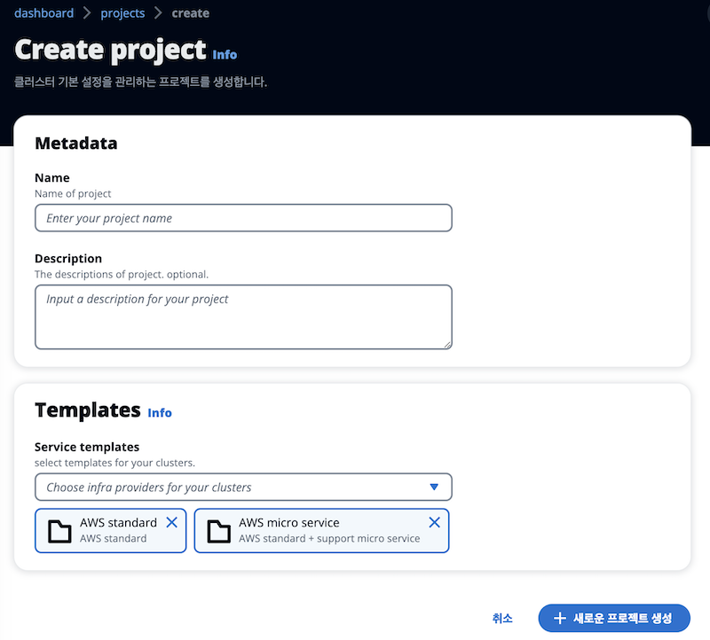
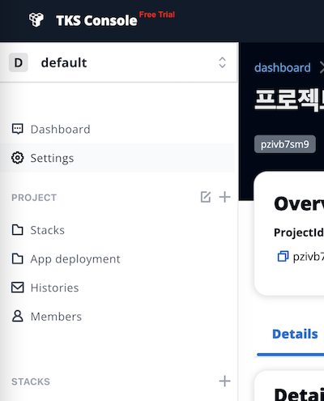
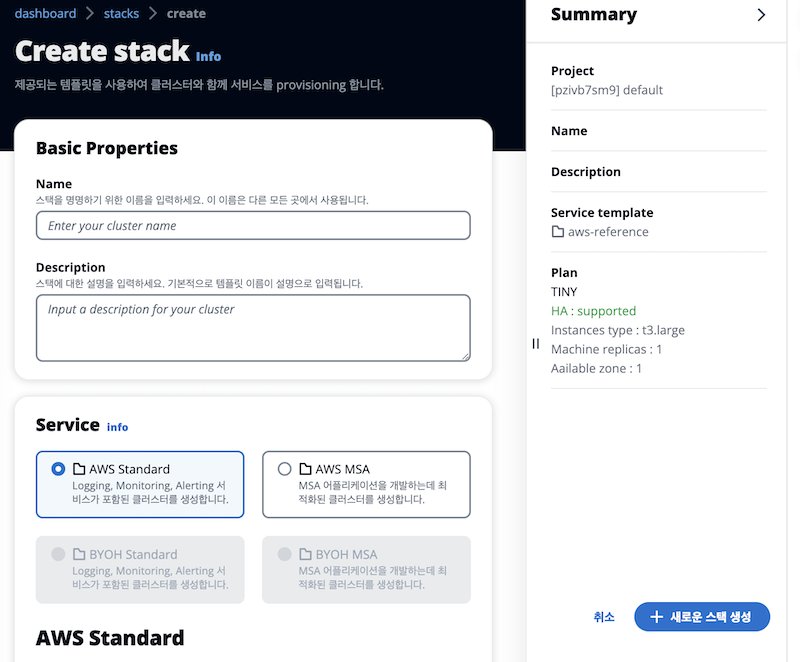
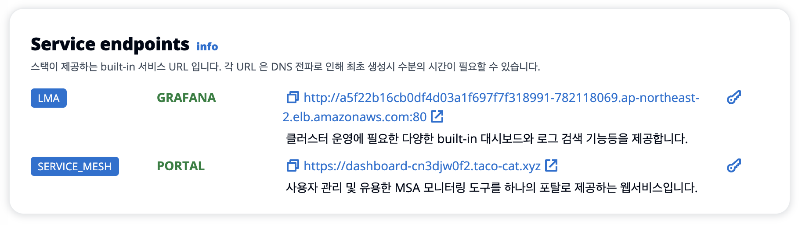
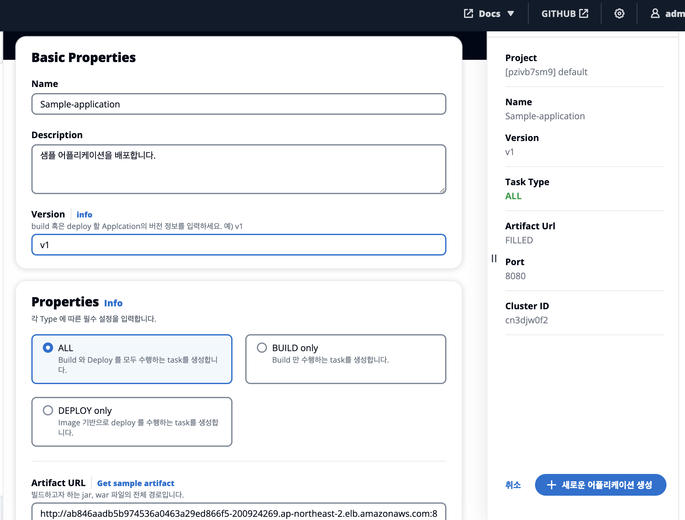
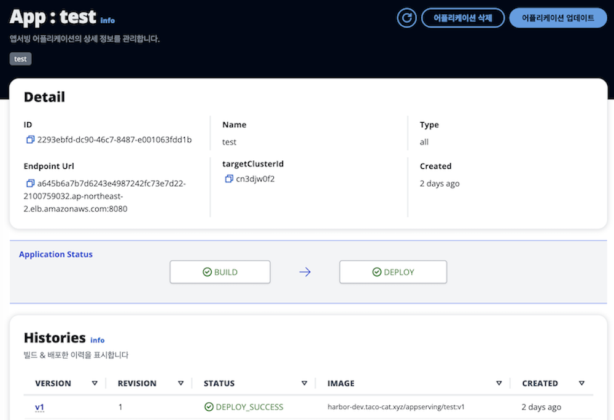
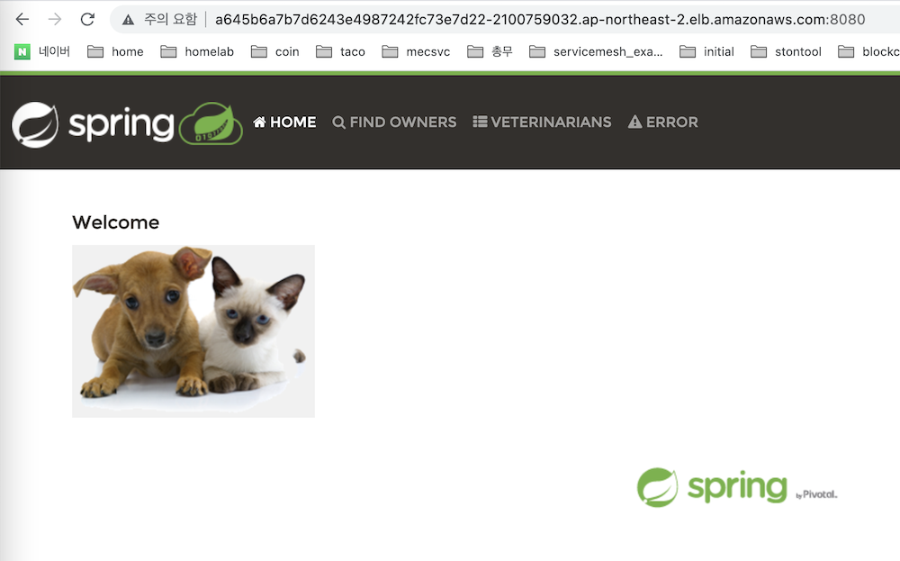

# Getting Started

TKS console 에서 제공하는 **스택** 클러스터를 생성하여 간단한 사용자 어플리케이션을 클러스터에 배포해 보겠습니다. 또한 배포된 클러스터 및 서비스를 사용하는 간단한 방법을 알아봅니다.

## **Prerequsition**
TKS Console 서비스를 사용하기 위해서는 체험 계정이 필요합니다. 아직 체험 계정이 없는 경우 **체험 계정을 생성**합니다.

## **Signin**
1. [**TKS Console**](http://container.sktenterprise.com){:target="_blank"} 를 접속하여 [**Console**](https://ft-console.taco-cat.xyz/signin) 버튼을 눌러 로그인 페이지로 이동합니다. 
2. TKS 로부터 발급 받은 체험 계정을 사용하여 로그인합니다.

## **Create Project**

TKS 접속 후 가장 먼저 할 일은 [**프로젝트**](../core-concepts)를 만드는 것입니다.   

1. [**Create your first project**](https://ft-console.taco-cat.xyz/projects/create){:target="_blank"} 버튼을 클릭하여 프로젝트를 생성합니다. Free-Trial 버전은 template 커스터마이징을 제공하지 않으므로 기본 설정으로 생성합니다.

2. 이름과 설명을 입력하여 좌하단 **+새로운 프로젝트 생성** 버튼을 클릭하여 프로젝트를 생성합니다.   

> 프로젝트는 TKS 의 핵심 컨셉 중 하나로 각종 메타 데이터와 인프라프로바이더, 서비스등을 관리합니다.   
프로젝트 상세 페이지에서 프로젝트가 관리하는 정보들을 확인할 수 있습니다.   

3. 사이드 메뉴에서 프로젝트를 선택하면 이제 프로젝트 내에서 할 수 있는 메뉴가 표시됩니다. 각 메뉴는 아래와 같습니다.   

> 상단의 프로젝트 콤보박스에서 프로젝트 단위로 테넌시 관리가 가능합니다. 메뉴의 모든 내용은 프로젝트에 종속됨을 유의하세요.
	- Dashboard : 요약 정보 및 비정상 상태 표시 
	- Settings : 설정 정보 관리
	- Stacks : 스택 관리
	- App Deployment : CD 어플리케이션 관리
	- Histories : 작업 내역 조회
	- Members : 사용자 관리

## **Create Stack**

어플리케이션을 배포하기 위한 [**스택**](../core-concepts) 클러스터를 생성합니다. 여기에서 생성한 스택 클러스터는 어플리케이션 배포만을 위한 클러스터가 아닌 일반적인 kubernetes 클러스터입니다.
> 스택은 TKS 의 핵심 컨셉 중 하나로 Kubernetes 클러스터와 선택가능한 서비스까지 포함한 TKS 만의 논리적인 클러스터 개념입니다.

1. 왼쪽 메뉴바 중반의 STACKS 옆의 [**+**](https://ft-console.taco-cat.xyz/stacks/create){:target="_blank"} 버튼을 클릭하거나 [**create new stack**](https://ft-console.taco-cat.xyz/stacks/create){:target="_blank"} 버튼을 클릭하여 스택 생성 페이지로 이동합니다.

2. 이름과 설명을 입력하고, 서비스를 선택합니다.
	- AWS Standard (LMA): 기본 Kubernetes 클러스터와 같이 LMA (Logging, Monitoring, Alerting) 서비스를 설치합니다.
	- AWS MSA : (**recommended**) AWS Standard 템플릿의 모든 내용과 MSA 를 위한 소프트웨어를 추가로 설치합니다.

3. kubernetes 클러스터 생성은 약 10분 정도 소요되며, 클러스터 생성후 서비스는 백그라운드로 설치됩니다. 모든 스택이 설치되기까지는 약 20-30분정도가 소요됩니다.

4. 이제 스택 클러스터 배포가 완료되었으며 kubeconfig 를 다운로드 받아 kubernetes 에 접속하거나 제공되는 서비스를 활용하여 클러스터를 관리할 수 있습니다.

### Kubernetes cluster 접속
스택 상세화면 상단의 **kubeconfig 다운로드** 를 클릭하여 kubeconfig 를 다운로드 받을 수 있습니다.   
다운로드 받은 kubeconfig 를 사용하여 kubernetes 클러스터에 접속/명령 할 수 있습니다.

### TKS service 접속
설치된 서비스에서 제공하는 웹URL 을 사용하여 직접 웹페이지에 접속할 수 있습니다. 계정 정보가 필요하다면 열쇠모양 아이콘을 클릭하여 계정 정보를 확인 할 수 있습니다.

## **Application Deployment**
생성된 스택 클러스터에 사용자 어플리케이션을 배포해보겠습니다. 사용자 어플리케이션은 JAVA springboot 로 개발된 다음의 샘플App 이라고 가정합니다.
> [다운로드 : JAVA 샘플 App](http://ab846aadb5b974536a0463a29ed866f5-200924269.ap-northeast-2.elb.amazonaws.com:8081/repository/my-release-repo/default/petclinic/1.0/petclinic-1.0.jar)

1. 왼쪽 사이드 메뉴에서 **App Deployment** 를 선택하여 Applications 관리 화면으로 이동합니다. 
2. 오른쪽 상단의 [**+새로운 어플리케이션 생성**](https://ft-console.taco-cat.xyz/apps/create) 버튼을 클릭하여 생성 화면으로 이동합니다.

3. 이름, 설명을 입력하고 배포하고자 하는 어플리케이션의 버전을 입력합니다. 이 버전은 이미지 tag 로 사용됩니다. ( 본 예에서는 v1 으로 지정하였습니다. )
4. Properties의 타입을 **ALL** 을 선택하여 빌드와 배포를 동시에 진행합니다.
5. Artifact URL 은 **Get sample artifact** 버튼을 눌러 상단의 샘플 Java Application 을 입력합니다.
6. 배포할 클러스터를 방금 생성한 스택을 선택합니다.
7. 오른쪽 하단의 **+ 새로운 어플리케이션 생성** 버튼을 눌러 생성합니다.
8. 배포한 샘플App의 상태가 아래와 같이 DEPLOY_SUCCESS 으로 상태가 변경이 되었다면 배포가 완료되었습니다.   
샘플App이 정상적으로 배포되었는지 아래 그림의 Endpoint Url 을 복사하여 웹페이지에서 확인합니다.   
 
9. 샘플App이 정상적으로 kubernetes 클러스터에 배포되었음을 확인합니다.   

