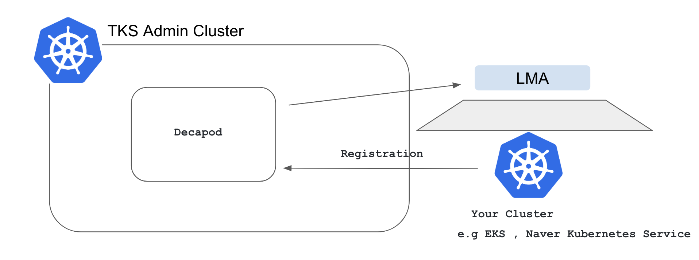

# SKT Enterprise Kubernetes Solution

## About This
SKT Enterprise Container Solution release 3.0.0 이 출시 되었습니다.   
SKT Enterprise Container Solution은 그동안 SKT가 공개해 왔던 Open Source를 활용하여, Production level의 Kubernetes 배포관리 할 수 있는 Solution 입니다. SKT Enterprise Container Solution은 GitOps 기반 Kubnernetes fleet management를 제공하고 제공 기능이 API로 제공되어 CaaS(Container as a Service)로 활용 할 수 있습니다.  이번 릴리즈는 Kubernetes 1.23를 제공합니다.

## New Features and Enhancements
- **BYOH provider support**    
    Cluster API의Provider중 하나인 BYOH(Bring Your Own Host)를 지원한다. BYOH는Kubernetes의Container Runtime이 설치된 Host (물리서버나 VM)에 BYOH Agent를 설치하여, TKS Management Cluster가 BYOH Agent가 설치된 Server에 TKS Cluster를 설치/관리할 수 있게 해 준다. 이를 활용하여 공식적으로 Cluster API Provider를 지원하지 않는 Public Cloud (e.g. Naver Cloud)에 TKS를 구동할 수 있게 할 수 있다.   
    >[BYOH 설명](../architecture/byoh.md)
- **TKS Stack**   
    Release 2.0은 Cluster 생성과 Service 생성이 분리되어 있다. 하지만 Platform 입장에서 Cluster+Service의 조합이 MSA를 지원하는 Platform이고, Service별 Add-on과의 종속성이 발생하는 바, Cluster와 Meta Service를 하나로 묶은 Template을 Stack이라 이야기하고, 이를 추가로 제공한다.        
    > [TKS Stack]      
- **App Serving**   
    Thanos를 도입하여 Promethes가 갖는 본질 적인 문제를 보완했다. (High Availiability, Long term storage). 또한 Thanos를 활용해, Multi cluster query 기능을 제공한다.
    Elasticsearch 유료화 정책에 대응하기 위해, Loki를 적용했다.   
    > [App Serving 설명](../architecture/appserving.md)   

## Tech Preview
- **Bring your own Kubernetes**
    EKS와 같은 완전 관리형 서비스의 경우, CSP의 자원 IAM 체계를 통한 인증, Control Plane에 대한 Auto-scaling 및 비과금과 같은 장점이 존재한다.  
    또한 EKS와 같은 관리형 K8S의 경우, 기본적으로 바닐라 K8S의 API를 사용함으로 Add-on의 종속성을 제외하고는 워크로드 입장에서는 종속성이 적다. (일분 PVC와 같은 부분에 종속성이 존재한다.)
    따라서 EKS와 같은 이미 설치된 K8S를 TKS의 관리체계에 포함시켜 LMA와 같은 SaaS를 제공하는 방안을 제공한다.   
    
 
- **TKS Portal**   
    현재 제공된 TKS API를 사용하는 UX 환경을 제공 한다. 
    
## Future Plan
- **Air gap 지원**   
    Air gap 환경은 보안상 Internet 연결이 제한되는 환경이다. 보통 On-prem환경에서 많이 적용되지만, Public Cloud에서도 On-prem의 확장개념이 적용된 경우 같이 논리적으로 적용된다.
    다음 Release는 Air gap에서도 GitOps를 적용하기 위해 Local git/registry service를 활용 수 있게 할 예정이다.
- **AI Serving**   
    AI는 전방위로 활용되어 지고 있다. 따라서 CaaS 차원에서 AI workload 지원을 위해, GPU support와 GPU 자원의 효율적인 사용을 위한 Serverless를 지원 할 예정이다.
## Dependancy
|Repo|Branch|Comment|
|:---|:---|:---|
|[helm-charts](https://github.com/openinfradev/helm-charts)|release-v3|사용 Helm Chart|
|[decapod-bootstrap](https://github.com/openinfradev/decapod-bootstrap)|release-v3|Decapod pipeline 설치|
|[tks-mgmt-cluster-deploy ](https://github.com/openinfradev/tks-mgmt-cluster-deploy)|release-v3|Admin clutser Bootstrap tool|
|[tks-custom-base-yaml](https://github.com/openinfradev/tks-custom-base-yaml)|release-v3|Decapod가 제공하는 서비스중 K8S Cluster|
|[decapod-base-yaml](https://github.com/openinfradev/decapod-base-yaml)|release-v3|Decapod가 제공하는 Service|
|[decapod-flow](https://github.com/openinfradev/decapod-flow)|release-v3|Decapod가 제공하는 서비스 설치를 위한 Workflow|
|[tks-flow](https://github.com/openinfradev/tks-flow)|release-v3|Decapod workflow중 CaaS 연계하는 Workflow|
|[tks-proto](https://github.com/openinfradev/tks-proto)|release-v3|CaaS를 위한 API grpc proto|
|[tks-common](https://github.com/openinfradev/tks-common)|release-v3|CaaS API Common|
|[tks-info](https://github.com/openinfradev/tks-info)|release-v3|CaaS API informarion|
|[tks-batch](https://github.com/openinfradev/tks-batch)|release-v3|CaaS Internal Service|
|[tks-cluster-lcm](https://github.com/openinfradev/tks-cluster-lcm)|release-v3|CaaS API LCM|
|[tks-contract](https://github.com/openinfradev/tks-contract)|release-v3|CaaS API for multi-tenant|
|[tks-client](https://github.com/openinfradev/tks-client)|release-v3|cli tool|
|[tksadmin-client](https://github.com/openinfradev/tksadmin-client)|release-v3|cli tool|
